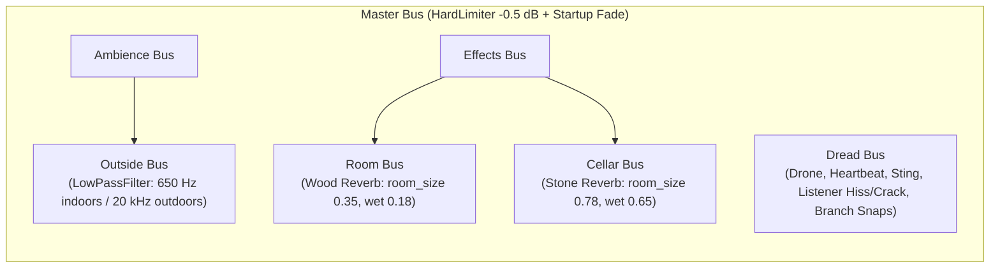

# Run Away — Game Design Document

**Version:** `0.0.13`
**Engine & Stack:** Godot 4.7 (Forward+ Renderer, Jolt Physics, Typed GDScript)
**Perspective:** Third-Person Over-the-Shoulder
**Genre:** Short Authored Daylight Winter Horror
**Target Session Length:** Single continuous run (~6–12 minutes depending on exploration and note reading)

---

## 1. High Concept & Design Pillars

> *"A daylight snowfield, a wire fence, and something that learns you by the notes."*

**Run Away** is a compact, atmospheric third-person horror game set on an enclosed alpine ridge in bright, overcast winter daylight. The player wakes inside a furnished timber house with a subterranean mortuary beneath it, steps out onto a 243-metre snow-covered trail toward a pair of waiting headlights on a road, and navigates two distinct, rule-bound entities in the snowfield.

Unlike conventional survival horror that explains its lore through exposition or climactic reveals, **Run Away** is built as an argument between **three physical records**:
1. **The Pages** left along the ridge, which claim a sequence of events and demand that the reader stand still to finish the line.
2. **The Institutional File** in the cellar mortuary and field dossier, which logs measurements, a procedure for surviving breath-seeking hoarfrost, and an incomplete initial.
3. **The Snow Itself**, where the player's own boots press a physical trail that quietly disagrees with what the pages claim happened.

### Core Design Pillars

1. **Survival Is Understandable; Identity Is Unresolved**
   Every lethal threat operates by a strict, learnable physical rule (movement vs. stillness; exhalation vs. holding breath). By contrast, whether the woman who woke in the bed, the writer of the notes, and Mara ahead on the ridge are three people or one person is deliberately never resolved.
2. **One Lethal Rule Speaks at a Time**
   The two field threats—**The Listener** (which hunts visible breath) and **The Figure in the Tree Line / The Hunter** (which stalks stillness and pursues down the trail)—never talk over each other. Before the hunt begins, the Listener governs the early field while the Figure watches from the trees. Once the hunt triggers, the Figure steps into the foreground and the Listener yields into a slow drift.
3. **Environmental Contradiction Without UI Counters**
   The game never displays a clue counter, objective checklist, or minimap. When the house or the snow contradicts a note—a bedroom lantern relit behind your back, a doormat turned askew upon return, a sheeted body laid out while the mortuary was empty, or a boot print that could not belong to your stride—the world simply leaves the physical evidence for the player to notice.
4. **Reading Changes Risk, Not Activation**
   Reading field notes freezes the player in place while the world continues to move, and reading three trail pages triggers the Hunter's pursuit early. However, players who skip every note still trigger the pursuit once they cross 85 metres along the route. Curiosity accelerates danger; ignoring the story cannot bypass the game.

---

## 2. Narrative Architecture: The Three Accounts

### 2.1 The Three Overlapping Figures
Across the house and trail, three presences overlap without ever collapsing into a single confirmed biography:
- **The Sleeper (Upstairs Bedroom):** Wakes beside a lantern she did not light, wrapped in warm wool that is not hers, next to a bedside note addressed to an unknown reader.
- **The Writer (Ground Floor & Trail Pages):** Counts footsteps to and from the step, insists the doormat stayed straight, notices her own handwriting changing into the hand that waved at the gap, and begs the reader in the final note (*"don't"*) to stay still until the line is finished.
- **Mara / The Pack / The Mortuary Sheet:** The pack strap is stamped `M. Aune`, yet the mortuary intake card downstairs records a body brought down from the step measuring `1.6 m` (matching neither the `2.4 m` nor `1.9 m` sheets in the Listener's file) with the copied strap initial `R.` and an unfinished second stroke.

### 2.2 Complete Document Catalog
There are **8 readable documents** in the world (`scripts/notes/note_catalog.gd` and `scripts/anomalies/listener.gd`): **2 house notes**, **1 institutional anomaly record**, and **5 numbered trail notes**. Only the 5 trail notes increment `Game.notes_found` (`counts = true`).

| Document | Location | Counts Toward Hunt | Corruption | Narrative & Mechanical Role |
| :--- | :--- | :---: | :---: | :--- |
| **`by the bed`** | Bedroom nightstand | No | `0.12` | Establishes the pre-lit lantern, the burned-down tin candle, the warm wool, and the writer leaving for the front step. |
| **`intake`** | Cellar mortuary desk | No | `0.06` | Logs a `1.6 m` body under the sheet brought from the step, with strap initial `R.` and an unfinished second stroke. |
| **`OBJECT 2-117 — "THE LISTENER"`** | Early trail (~14 m offset) | No (`is_record`) | `0.00` | Institutional dossier teaching the exact counterplay for the Listener: stop running, hold breath, walk, and choose where to exhale. Marks `Game.understand("2-117")` when read. |
| **1. `Field Note — Day 3`** | Early trail (~22 m) | Yes (`1/5`) | `0.00` | Introduces Mara ahead on the ridge and the thing in the pines that lifted its hand after she did. |
| **2. `from the pack`** | Trail camp / pack | Yes (`2/5`) | `0.08` | Details the `M. Aune` strap, an unburned half-candle, and the footprint count that gained one extra step stopping at the straight doormat. |
| **3. `torn page`** | Mid-trail | Yes (`3/5`) | `0.28` | Connects holding breath past the camp lantern, bare branches forming a shape, and the argument over whether the lights at the end are a car. **Reading this 3rd trail note starts the Hunt.** |
| **4. `the handwriting changes`** | Upper-mid trail | Yes (`4/5`) | `0.48` | The writer admits she is writing with the hand that waved, notes her breath no longer fogs the paper, and claims the cabin lantern relights and the mat stays straight when returning. |
| **5. `don't`** (`LAST_TITLE`) | Late trail before road | Yes (`5/5`) | `0.72` | High glyph corruption. Commands the player to stay until the end of the line, warns that three strikes on the door count for what is on the step, and states *"it is behind you."* |

---

## 3. Playable Sequence & Pacing

```mermaid
flowchart TD
    A["Phase: INTRO (3.2s)\nWake in Cabin Bedroom"] --> B["Act I: Explore the House\nBedroom -> Hall/Living -> Cellar Mortuary"]
    B --> C["Act II: Early Trail (0m – 85m)\nEncounter OBJECT 2-117 (The Listener)"]
    C -->|Optional Return after >= 22m| D["Changed House & Snow Evidence\nTurned Mat + Unseen Doorway Sole + Paired Track (>30m)"]
    D --> C
    C -->|Read 3 Trail Notes OR Cross 85m| E["Act III: The Hunt Begins (Game.hunt_started)\nListener Yields to DRIFT; Hunter Pursues"]
    E -->|Retreat Indoors| F["Doorstep Siege\nHunter Waits at Front Step; Hunt Clock Continues"]
    F --> E
    E -->|Caught by Hunter| G["Ending: CAUGHT ('You stopped')\n+ 'The count closed.' if reading 'don't'"]
    C -->|Heard Breathing by Listener| H["Ending: CAUGHT ('It heard you breathe')"]
    E -->|Reach Road Headlights (Exit <= 13m)| I["Ending: ESCAPED ('The road')\n+ 'The line was not finished.' if 'don't' was read"]
```

### Act I: Waking in the House
- The player spawns in the upstairs bedroom during `Phase.INTRO` (`3.2 s`). Audio is settled to indoor shelter (`shelter = 1.0`, `650 Hz` wall low-pass filter) from frame 0 and smoothly fades in after a 4-frame startup hold.
- Exploring the house reveals three distinct layers:
  - **Bedroom:** A burning lantern, warm wool, and the `by the bed` note. When the player leaves the bedroom, the lantern silently goes out; if she returns, it stutters back to life.
  - **Ground Floor (Hall, Living Room, Back Hall):** Front door with its entry mat, fireplace, and the straight staircase descending into the cellar.
  - **Cellar (Landing, Corridor, Janitor Room, Mortuary):** A limewashed subterranean wing extending beneath the snowpack. On the first descent, footsteps cross the floorboards overhead toward the stair head (`Haunting._steps()`). Inside the mortuary sits the `intake` card and empty examination tables. Once the player leaves the mortuary and it is out of view, a sheeted body is silently laid onto the table (`Haunting._lay_body()`).

### Act II: The Early Trail & The Return
- Stepping through the front door onto the snowfield introduces the cold vignette, visible breath plumes, and outdoor wind.
- At ~14 m along the trail, the player can read the institutional dossier `OBJECT 2-117 — "THE LISTENER"`.
- After `18.0 s` (`WAKE_AFTER`), **The Listener** awakens in the snowfield (55–95 m from the start) and glides toward any visible vapour plume. The player learns to manage exertion, hold her breath (`C` or `Q`), or use the cabin walls as a genuine refuge.
- **The Contradictory Return:**
  - Once the player has walked at least `22.0 m` (`RETURN_CLUE_ROUTE_DISTANCE`, past the first trail note) and returns to the house while the front mat is out of the camera frustum, **the mat rotates `0.38 rad` askew** (`Haunting._turn_mat()`)—directly contradicting Note 4's claim that *"the mat is still straight."*
  - Simultaneously, an oversized, high-pressure **sole print with no snow berm** (`Footprints.Mark.SOLE`, `evidence = true`) is stamped just outside the doorstep while out of view (`Haunting._lay_door_mark()`).
  - Once the player has walked past `30.0 m` (`WRONG_TRACK_ROUTE_DISTANCE`) after leaving at least 10 of her own footprints, the snow lays a **side-by-side paired boot mark** (`Footprints.Mark.PAIR`, `evidence = true`) off-camera along her earlier path (`Footprints._lie_once()`), visible if she glances back or doubles back toward the cabin.

### Act III: The Handoff & The Pursuit
- Prior to the hunt, **The Hunter** operates in `_stalk()` mode: appearing silently in the player's peripheral vision (16–30 m away) with glowing red eyes, and vanishing with an optional branch snap if watched for `> 0.55 s` or approached within `7.5 m`.
- **Hunt Activation (`Game.start_hunt()`):** Triggered Either when `Game.notes_found >= 3` (`Tune.HUNT_NOTES`) **or** when the player advances `>= 85.0 m` (`Tune.HUNT_ROUTE_DISTANCE`) along the trail while outdoors.
- **The Rule Handoff:** As soon as `Game.hunt_started` becomes `true`:
  - The Listener immediately drops out of `HUNT`/`LISTEN` into `DRIFT` and cannot catch the player (`Listener._physics_process()`).
  - The Hunter spawns 16–22 m behind the player (if not already closer) and begins relentless direct pursuit (`Hunter._pursue()`).
  - If the player retreats inside the cabin during the hunt, the Hunter does not cross the threshold; it walks to the front doorstep and waits (`Hunter._pursue()`), triggering frantic hard knocks (`Haunting._knock()`) while the active-play hunt timer (`_hunt_seconds`) continues to escalate its speed and threat level.

### Act IV: The Road & Endings
Reaching within `13.0 m` (`Tune.EXIT_RADIUS`) of the trail's exit point (`243.2 m` along the authored route, where waiting car headlights cut through the fog) triggers `Game.escape()`. Depending on how the run ends and whether the 5th trail note (`"don't"`) was opened, the player receives one of **four ending variations** (`scripts/ui/end_card.gd`):

| Outcome | Condition | End Card Title | End Card Body | Restart Button |
| :--- | :--- | :--- | :--- | :--- |
| **Escape (Pure)** | Reach exit; never opened Note 5 (`"don't"`) | `The road` | *"Headlights. You do not look back."* | `Walk the ridge again` |
| **Escape (Unfinished Debt)** | Reach exit after opening Note 5 (`Game.read_last_page == true`) | `The road` | *"Headlights. You do not look back. The line was not finished."* | `Walk the ridge again` |
| **Caught by Hunter (Standard)** | Hunter closes within `2.15 m` at `threat >= 0.48` (Note 5 not currently open) | `You stopped` | *"The snow where you were is pressed flat. Nothing leads away."* | `Wake in the cabin` |
| **Caught by Hunter (Count Closed)** | Hunter catches player while Note 5 (`"don't"`) is open (`Game.reading_last_page()`) | `You stopped` | *"The snow where you were is pressed flat. Nothing leads away. The count closed."* | `Wake in the cabin` |
| **Caught by Listener** | Listener closes within `1.6 m` while `plume > 0.1` before the Hunt | `It heard you breathe` | *"The cloud left your mouth and it was already there. The cold went in where the air came out."* | `Wake in the cabin` |

---

## 4. Core Gameplay Systems & Mechanics

### 4.1 Player Locomotion, Stamina & Breath (`scripts/player/`)
The player character uses the Styloo Elf mesh (`0.8` scale) driven by retargeted skeletal locomotion (`Stride`, `FootLock`, `Grace`) with decoupled speed and heading momentum:
- **Walk & Sprint:** Walks at `1.83 m/s` (`WALK_SPEED`) and sprints at `6.85 m/s` (`SPRINT_SPEED`). Hard cornering while sprinting bleeds speed (`TURN_BLEED = 0.35` per radian), and sharp reversals (`> 2.4 rad` above `0.9 m/s`) plant and brake (`STRIDE_BRAKE = 20.0 m/s²`).
- **Per-Step Surge & Foot Locking:** Each footstrike checks slightly on impact and surges on push-off (`STEP_SURGE_WALK = 0.03`, `STEP_SURGE_SPRINT = 0.06`), while `FootLock` prevents foot sliding and raycasts the surface (`snow`, `wood`, `stone`) to trigger matching 3D footfall audio and snow kicks (`SnowKick`).
- **Jumping & Downhill Snow Sliding:**
  - Jump (`Space`) applies `5.4 m/s` vertical velocity with variable jump cut (`0.5`), coyote time (`0.12 s`), jump buffer (`0.14 s`), and costs `0.45` stamina.
  - Pressing `C` while sprinting (`>= 4.2 m/s`) triggers a snow slide (`SLIDE_BOOST = 1.3 m/s`, `SLIDE_SLOPE = 9.0` downhill acceleration, `0.4` stamina cost), lowering the player's profile and camera height while hissing across the snowpack.
- **Stamina & Breath Plume (`Breath`):**
  - Maximum stamina is `4.6 s` (`STAMINA_MAX`), regenerating at `1.35 /s` (`STAMINA_REGEN`). Fully depleting stamina locks sprinting for `0.85 s` (`EXHAUST_LOCK`) until stamina recovers to `1.6` (`SPRINT_RESUME`).
  - Exertion drives a physical cold-air vapour plume (`breath.plume` from `0.0` to `1.0`) rendered at the player's mouth.
  - **Holding Breath (`Q` or `C` when not sliding):** Immediately suppresses `breath.plume` to `0.0` (hiding the player from the Listener) while draining stamina at `0.6 /s` (`HOLD_DRAIN`).
- **Camera & Lantern:**
  - Third-person `SpringArm3D` camera adjusts smoothly between outdoor distance (`3.1 m × camera_distance`, `0.0 m` shoulder offset) and tight indoor framing (`INDOOR_BOOM = 1.35 m`, `INDOOR_SHOULDER = 0.32 m`), with terrain clearance raycasts so the camera never clips under one-sided snow slopes.
  - A warm omni-light lantern (`Color(1.0, 0.78, 0.52)`) rides at the player's hip, burning brighter indoors (`_glow = 1.0`) and flickering subtly in the wind outdoors.

### 4.2 The Snow as a Living Record (`scripts/player/footprints.gd`, `shaders/footprint.gdshader`)
Rather than flat decals, footprints are 96 pooled, subdivided `1.0 m × 1.0 m` meshes (`16 × 24` vertices) using `shaders/footprint.gdshader` to displace vertices into the `0.2 m` snowpack:
- **Four Mark Types (`Footprints.Mark`):**
  - `HERS (0.0)`: Standard boot stride—sinks a packed concave bowl and raises a displaced snow berm around the rim.
  - `SOLE (1.0)`: An impossible flat depression with **no displaced berm** (used outside the returned-to front door, scaled `1.3×` with `press = 1.0`).
  - `BERM (2.0)`: A raised rim of snow with **no boot bowl** inside it.
  - `PAIR`: Stamps two boots side-by-side (`±0.11 m` lateral offset) perpendicular to the player's outbound track after 30 m.
- **Retention & Pool Protection:**
  - Ordinary footprints hold for `14.0 s` (`HOLD`) and fade over `18.0 s` (`FADE`).
  - The 3 narrative evidence patches (`evidence = true`: the 2 boots of the `PAIR` mark and the doorway `SOLE`) hold for **`240.0 s` (`Tune.EVIDENCE_HOLD`, 4 minutes)** and are protected from ring-buffer overwrite by subsequent footsteps (`Footprints._lay()`).
  - Footprint aging freezes during `PAUSED`, `CAUGHT`, and `ESCAPED` phases.

### 4.3 Threat I: OBJECT 2-117 — "The Listener" (`scripts/anomalies/listener.gd`)
- **Visual & Audio Signature:** Uses the Quaternius rig scaled tall and thin (`0.62 × 1.3 × 0.62`) with an elongated neck (`2.1×` length) and dark grey-blue hoarfrost material (`clearcoat` + bright frosted rim). Its animation is frozen in a single hanging-arm idle; it **never walks**, gliding silently across the snow while shedding frost particles and cocking its head bone (`0.55 rad`) when listening or hunting.
- **Perception Rule:** Perceives only visible breath (`plume > 0.08`) within `HEAR_CALM + HEAR_PLUME * plume` (`10 m` at rest up to `40 m` when panting after a sprint). Indoors, cabin walls hide the vapour cloud completely (`plume = 0.0`).
- **State Machine:**
  - `STILL`: Dormant for the first `18.0 s` of play.
  - `DRIFT`: Glides slowly (`0.55 m/s`) around the region where breath was last detected.
  - `HUNT`: Triggered by a low-pitched ice crack (`snap.wav` at `0.42–0.5×` pitch) when vapour is detected. Glides at `3.3 m/s` (`HUNT_SPEED`) paired with a high-pitched wind hiss toward the **exact world coordinate where the breath was exhaled (`_memory`)**, not the player's live position.
  - `LISTEN`: Lingers for `2.5–4.0 s` at the last known breath point with head cocked before returning to `DRIFT`.
- **Counterplay:** Stop sprinting, hold breath (`Q`/`C`), and walk away from the spot where you last exhaled—you can stand directly beside the Listener unharmed at `< 1.6 m` as long as `plume <= 0.1`.

### 4.4 Threat II: The Figure in the Tree Line (`scripts/hunter/hunter.gd`)
- **Visual & Audio Signature:** Cloaked pitch-black silhouette (`0.78 × 1.5 × 0.78` scale) with two unshaded crimson eye spheres (`Color(0.9, 0.16, 0.1)`) and a subtle red omni-light. Announces its position in the trees via 3D branch snaps (`play_snap`) every 4–18 seconds depending on threat.
- **Phase 1 — Stalking (`not Game.hunt_started`):**
  - Appears 16–30 m away in the player's peripheral vision (`dot(forward) <= 0.78`) for `5.5–8.5 s` playing `Idle`.
  - If the player stares directly at it (`dot > 0.86`) for `> 0.55 s` or closes within `7.5 m`, it vanishes and waits `4.5–14.0 s` (shortening as notes are read) before reappearing elsewhere.
- **Phase 2 — Pursuit (`Game.hunt_started`):**
  - Threat level (`_threat()`) scales from `0.26` to `1.0` based on notes read beyond 3 (`+0.23` per extra note) and active hunt duration (`+0.34` over `75.0 s`).
  - Speed interpolates via `smoothstep(0.2, 1.0, threat)` between `HUNTER_CREEP (1.4 m/s)` and `HUNTER_CHASE (5.7 m/s)`—faster than the player's walk (`1.83 m/s`), slower than her sprint (`6.85 m/s`), requiring stamina management and downhill slides to outrun.
  - **Cabin Threshold Rule:** Never enters the house. If the player is indoors, the Hunter walks to `house.doorstep()` and waits (`closeness` capped at `0.5` through the walls), while `Game._hunt_seconds` continues to tick upward.

### 4.5 The House & Haunting Director (`scripts/house/house.gd`, `scripts/house/haunting.gd`)
- **Tension Loop:** While the player is inside any room of the house, `Haunting.tension` rises at `+1.0 / 100 s` and decays outdoors at `-1.0 / 45 s`. Every `8–24 s` (scaling down as tension rises), the house fires a room-appropriate diegetic event:
  - `flicker`: Room lamps stutter for 5–11 beats.
  - `creak`: A floorboard groans 2–4 m directly behind the player's back.
  - `door`: A visible interior door (`2.2–12.0 m` away, not one the player is standing in) drifts open or shut on its own with a hinge creak.
  - `knock` (Ground floor): Three knocks sound on the front door—turning loud and frantic (`house_knock_hard`) if `tension > 0.75` or if the Hunter is waiting on the step.
  - `steps` (Cellar): 5–7 muffled bootsteps walk across the ground-floor boards overhead toward the top of the cellar stairs, sometimes ending in a creak or heavy thud.
  - `chamber` (Mortuary): A closed cold-storage mortuary door **behind the player's back** (`dot < 0.15`) swings open, followed `1.1 s` later by the metallic slide of a body tray.
  - `whisper` (`tension > 0.45`): A breathy 3D whisper plays `0.45 m` to the left or right ear, accompanied by one of four lines on the glass: *"Finish the line."*, *"The mat was straight."*, *"I did not wave."*, or *"The wool is still warm."*

---

## 5. World, Weather & Audio Architecture

### 5.1 World & Authored Level (`scripts/world/trail.gd`, `scripts/world/editable_level.gd`)
- **Enclosure & Terrain:** A `300 m × 300 m` wire-fenced basin (`X: [-150, 150]`, `Z: [-224, 76]`) with a `3.0 m` procedural snow grid (`Ground`), flattened foundation pads around the cabin/cellar, a stairwell cut into the earth, and multi-mesh alpine flora (`Flora`).
- **Hybrid Code + Editor Workflow:** Systems construct their nodes in code during `_ready()`, after which `EditableLevel.apply()` overlays hand-authored transforms, route curve adjustments, cabin furniture placements, and landmark tweaks stored in `scenes/editable_level.scn` (tracked via Git LFS).

### 5.2 Dynamic Volumetric Weather & Shelter (`scripts/weather/weather.gd`, `scripts/world/atmosphere.gd`)
- **Four-Regime Weather State Machine:** Weather evolves continuously across four distinct atmospheric fronts (`11–24 s` per regime, weighted toward heavier fronts as `Game.threat()` rises and after `Game.hunt_started`):
  - `CLEARING`: Brief high-visibility lulls (`intensity ~0.22`) with glittering airborne ice crystals (`DiamondDust`), low ground drift, and sharp directional sun shafts (`volumetric_fog_anisotropy = 0.62`).
  - `DRIFT`: Steady alpine snowfall (`intensity ~0.52`) with rolling ground spindrift ribbons and shifting crosswinds.
  - `SQUALL`: Heavy wind-sheared snow curtains (`intensity ~0.82`) with fast gale streaks, swirling mid-air squall veils, and rising wind roar.
  - `WHITEOUT`: Blinding blizzard fronts (`intensity ~1.0`, `whiteout ~0.92`) that compress visibility (`fog_density`, `volumetric_fog_density`, and low `anisotropy = 0.26` diffuse glare), whip violent gusts, and drive sub-bass storm pressure.
- **3D Volumetric Fog Shaders (`shaders/volumetric_weather.gdshader`):**
  - Dual `FogVolume` architecture: a basin-wide `SnowFog` volume (`360 × 44 × 360 m`) and a high-detail camera-following `SquallVolume` (`96 × 28 × 96 m`) that sculpt wind-sheared falling snow curtains, 2-octave 3D turbulent fog banks advected by `wind_scroll`, and dense ground-hugging spindrift (`0–3.8 m`).
  - **Indoor Volume Cutout:** Both volumetric fog shaders transform world points via `house_inv_transform` and evaluate a smooth signed-distance box cutout over the cabin and cellar so indoor rooms stay crisp while volumetric squalls visibly rage outside the windowpanes.
- **Six-Layer Particle Architecture (`scripts/weather/snow_layer.gd`, `shaders/spindrift.gdshader`):**
  - Combines `CanopyFlakes`, `NearFlurries`, `DiamondDust` (glittering ice prisms in clearings), `GaleStreaks` (high-velocity horizontal streaks during gusts), `GroundSpindrift` (billowing snow ribbons hugging terrain contours), and `SquallVeil` (broad translucent snow sheets during squalls/whiteouts).
- **Window Whistles & Immediate Spawn Settlement:** Six 3D wind-whistle emitters sit at the cabin's window openings, peaking when the player stands near the glass indoors. `Weather.settle()` snaps `shelter = 1.0` on frame 0 when spawning indoors so outdoor storm audio never leaks at launch.

### 5.3 Calibrated Audio & Bus Hierarchy (`scripts/audio/loudness.gd`, `scripts/game/settings.gd`)
All 3D sounds are calibrated in decibels SPL at 1 metre via `Loudness`, listening from a top-level `AudioListener3D` (`Player.ears`) placed at the character's head height (`+1.55 m`) rather than the camera boom 3 metres behind her.



---

## 6. User Interface & Controls

### 6.1 Diegetic & Minimalist HUD (`scripts/ui/`)
- **`Hud` (`scripts/ui/hud.gd`):**
  - Full-screen procedural vignette shader (`shaders/vignette.gdshader`) driven by cold/closeness/dread and stamina exhaustion.
  - Subtle bottom-center breath bar that appears only when stamina is below `98%` or breath is held, tinting icy blue while holding breath and warm red when exhausted.
  - Single-line whisper/threat hint that prioritizes whichever rule has higher pressure (`Listener.dread` vs. `Game.closeness`).
  - Context-sensitive `[E]` prompt (`Read <title>`, `Open door`, `Close door`) paired with a two-pass spatial outline shader (`shaders/interact_outline.gdshader`) that highlights the currently viewed interactable note or door leaf with a breathing frost-gold silhouette and rim glow.
- **`NoteReader` (`scripts/ui/note_reader.gd`):**
  - Opens a parchment modal without pausing the world (`Phase.READING`). Text reveals at `42 CPS` (`Tune.TYPE_CPS`) with typewriter ticks. Notes with `corruption > 0.0` substitute characters with corrupted glyphs as they type.

### 6.2 Controls Reference

| Input | Action | Description |
| :--- | :--- | :--- |
| `W` `A` `S` `D` / Arrows | `move_*` | Walk relative to camera heading |
| `Mouse` | Look | Orbit camera and steer heading |
| `Shift` | `sprint` | Sprint (`6.85 m/s`); drains stamina and builds breath plume |
| `Space` | `jump` | Jump (`5.4 m/s` vertical); costs `0.45` stamina |
| `C` (while sprinting) | `slide` | Downhill snow slide; boosts speed and lowers profile |
| `Q` or `C` (walk/idle) | `hold_breath` | Suppress breath plume (`plume = 0`); drains `0.6` stamina/s |
| `E` | `interact` | Read/close note, or open/close house and mortuary doors |
| `Esc` | `pause` | Toggle Pause & Settings menu (freezes world and clocks) |
| `R` | `restart` | Restart run from the cabin bedroom after `CAUGHT` or `ESCAPED` |
| `F1`–`F6` | Debug (`OS.is_debug_build()`) | `F1`: Next note, `F2`: Next anomaly, `F3`: Toggle debug HUD / summon anomaly, `F4`: Toggle indoor/outdoor spawn, `F5`: Trigger house haunt, `F6`: Cycle weather regime (`CLEARING`/`DRIFT`/`SQUALL`/`WHITEOUT`) |

---

## 7. Balance Reference (`scripts/tune.gd`) & Validation

### 7.1 Key Balance Constants

| Parameter | Constant | Value | Notes |
| :--- | :--- | :--- | :--- |
| Walk Speed | `Tune.WALK_SPEED` | `1.83 m/s` | Formal walk cycle |
| Sprint Speed | `Tune.SPRINT_SPEED` | `6.85 m/s` | Faster than Hunter's max chase speed |
| Hunter Speed Range | `HUNTER_CREEP` / `HUNTER_CHASE` | `1.4` – `5.7 m/s` | Scales with notes read (`>= 3`) + hunt time (`75 s`) |
| Listener Speeds | `DRIFT_SPEED` / `HUNT_SPEED` | `0.55` / `3.3 m/s` | Glides toward last seen breath coordinate |
| Listener Detection | `HEAR_CALM` / `HEAR_PLUME` | `10.0 m` – `40.0 m` | Scales linearly with `breath.plume` (`0.0` indoors) |
| Stamina Pool & Regen | `STAMINA_MAX` / `STAMINA_REGEN` | `4.6 s` / `1.35 /s` | `0.85 s` lock on full exhaustion |
| Hold Breath Drain | `Tune.HOLD_DRAIN` | `0.6 /s` | Up to `~7.6 s` continuous breath hold from full stamina |
| Return Clue Distance | `RETURN_CLUE_ROUTE_DISTANCE` | `22.0 m` | Distance required before returning turns the mat & stamps doorway sole |
| Wrong Track Distance | `WRONG_TRACK_ROUTE_DISTANCE` | `30.0 m` | Distance required before off-camera paired track (`Mark.PAIR`) spawns |
| Hunt Trigger (Notes) | `Tune.HUNT_NOTES` | `3` trail notes | House notes and anomaly records do not count |
| Hunt Trigger (Route) | `Tune.HUNT_ROUTE_DISTANCE` | `85.0 m` | Fallback trigger if player skips notes (total route is `243.2 m`) |
| Evidence Retention | `Tune.EVIDENCE_HOLD` | `240.0 s` | Protected footprint pool lifetime for narrative snow clues |
| Exit Radius | `Tune.EXIT_RADIUS` | `13.0 m` | Distance to road headlights required to trigger `ESCAPED` |

### 7.2 Automated Validation Probes (`tools/`)
The design's mechanical invariants and narrative state transitions are verified headlessly or with lean rendering via:
- `godot --headless --path . tools/run_sequence_probe.tscn`: 27-point integration suite verifying route escalation (`85 m`), note escalation (`3` notes), active-play clock freezing under pause, Listener-to-Hunter handoff, early-trail wrong track (`30 m`), excursion gate (`22 m`) on house return, unseen doorway sole placement, 96-slot footprint pool retention, all 4 ending text variants, and clean run reset.
- `godot --path . tools/return_evidence_probe.tscn`: Captures staged close-up and third-person verification shots of the turned mat and doorway sole mark.
- `godot --headless --path . tools/note_access_probe.tscn` & `tools/traversal_probe.tscn`: Verifies note reachability (`<= 2.6 m`) and route walkability from cabin to road.
